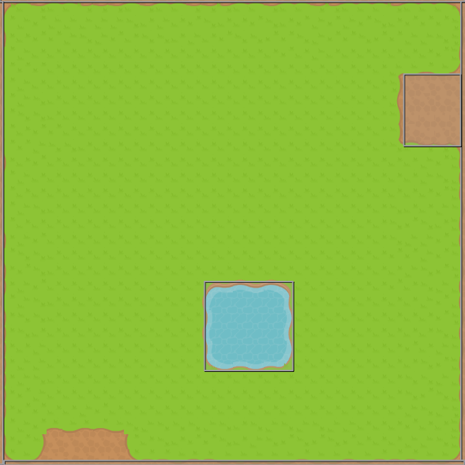
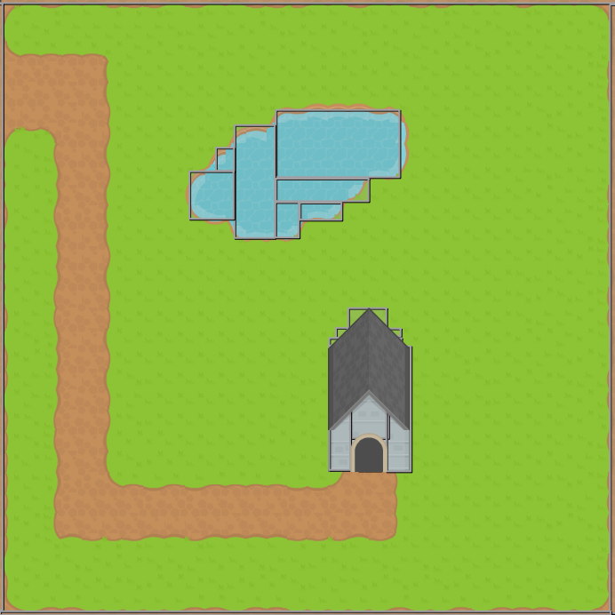
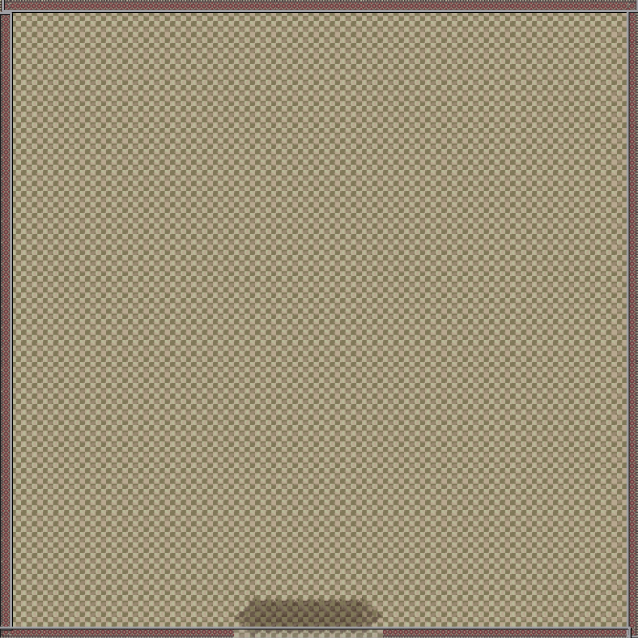
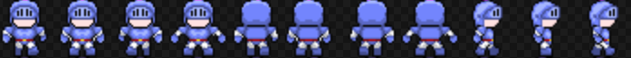
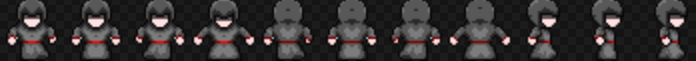

# 2do. Obligatorio de Programación de Videojuegos - Universidad ORT - 14 de Julio de 2020

- Carlos Andrés Chiale - Nro estudiante: 153309

Se desarrolla el obligatorio de acuerdo a lo pedido en la [letra](forReadme/Obligatorio2DVJ).

Se puede acceder al juego a tráves del siguiente link: https://carlos-chiale.github.io/Obligatorio2ProgramacionVideoJuegos/

## Desarrollo
El juego se realizo con el lenguaje [Haxe](https://haxe.org/), utilizando el frameork [Kha](https://github.com/Kode/Kha) y [Khawy](https://github.com/juakob/khawy).

Las pantallas del juego se desarrollaron utilizando tilemap en [Tiled](https://www.mapeditor.org/).

Se crearon tres pantallas:
- 1er nivel

- 2do nivel

- 3er nivel

Se utilizaron spritesheets para la animación del jugador, los enemigos y los objetos, por ejemplo:

### El Juego
El juego consta de tres niveles, el heroe empieza con 9 vidas.
- En el primero es necesario esquivar enemigos, para poder tomar una poción que permitirá correr más rápido y luego tomar el camino al segundo nivel. Cada vez que un enemigo toque al jugador, se pierde una vida.
- El segundo nivel, también hay que esquivar, esta vez más enemigos, para poder tomar una varita, con la que se puede disparar y matar a los enemigos. Luego de tener la varita, se puede entrar a la casa.
- El terecer nivel transcurre dentro de la casa, hay tres demonios que para matarlos, hay que dispararles varias veces. En caso de que toquen al heroe, este muere automáticamente.